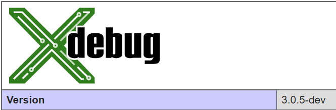
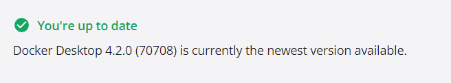
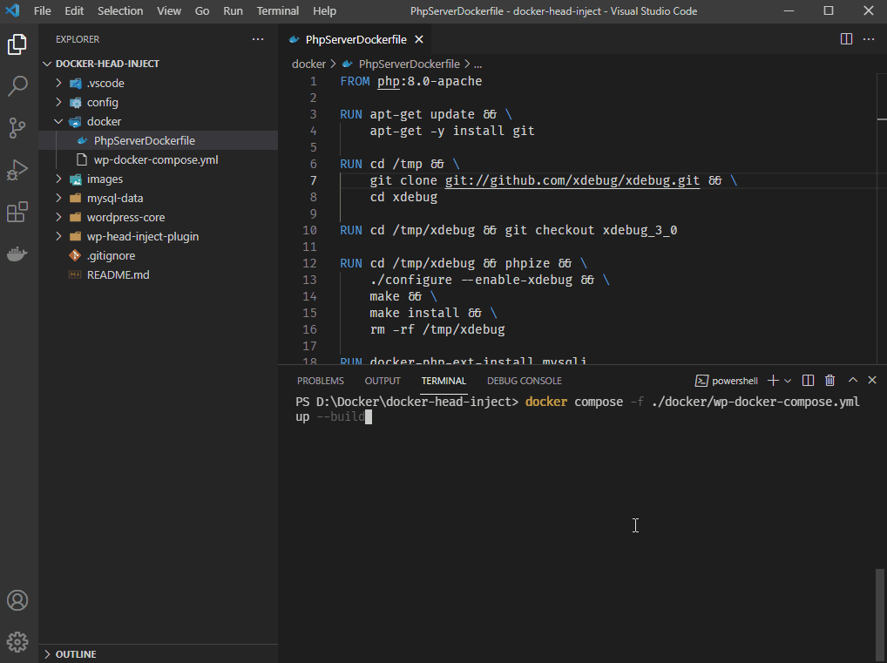
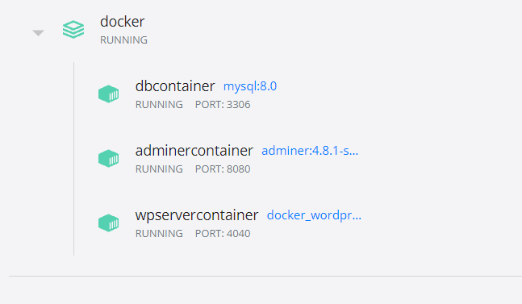

# XDebug 3.0 in Docker 4.2.0



The configuration in this repository uses **PHP 8.0** - Apache and **MySQL 8.0**. 

Change the docker images to the the PHP, MySQL or server versions.

```
FROM php:8.0-apache
RUN cd /tmp/xdebug && git checkout xdebug_3_0
db:
  image: mysql:8.0
adminer:
  image: adminer:4.8.1-standalone
```

Pulls the latest [XDebug 3.0](https://github.com/xdebug/xdebug) from GitHub. Can be connected from VSCode to step debug the developing WordPress plugin.



# Warning

Don't use the default configuration in production environment. Change the passwords.

# Project Organization

| Folder | Description |
| --- | ----------- |
| .vscode | VSCode files |
| config | Configuration files (php.ini, xdebug.ini, wp-config.php, etc.) |
| docker | Dockerfiles and docker-compose files |
| images | Images |
| mysql-data | MySQL data directory |
| wordpress-core | Core WordPress files - Downloaded from wordpress.org |
| wp-head-inject-plugin | WordPress plugin |


# WP Head Inject

A previous [WordPress plugin project on GitHub](https://github.com/praveendias1180/Head-Inject-WordPress-Plugin) was adopted to demonstrate the XDebug 3.0 in Docker 4.2.0 

# Docker Compose Up (--Build)

```
docker compose -f docker/wp-docker-compose.yml up --build
```



# Exposed PORTs from Dockerhost

- To access WordPress admin > http://localhost:4040/wp-admin/
- To access Adminer > http://localhost:8080/
- To access MySQL > PORT:3306 from host machine.

