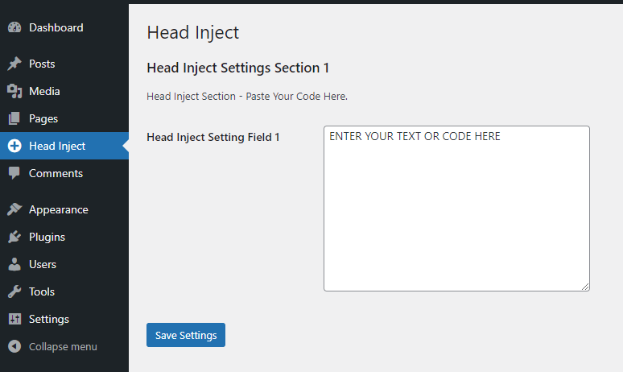
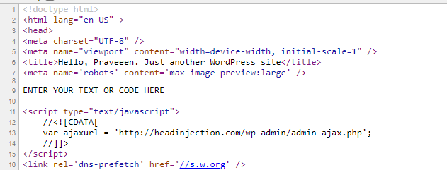

# Head Inject

Insert custom text or code to `<head>`. Use this plugin to insert custom text or code (stylesheet, script or any text) to every page of your WordPress site. Use the seperate admin page to insert and save your custom text.

## Head Inject Admin 

## Head Inject Public

Your text in html `head`.

[Browse Code @ GitHub](public/https://github.com/praveendias1180/head-inject)